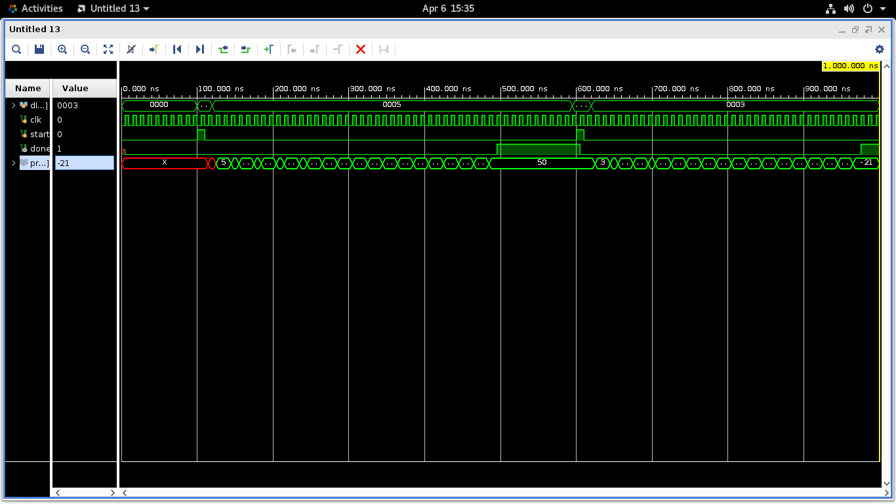
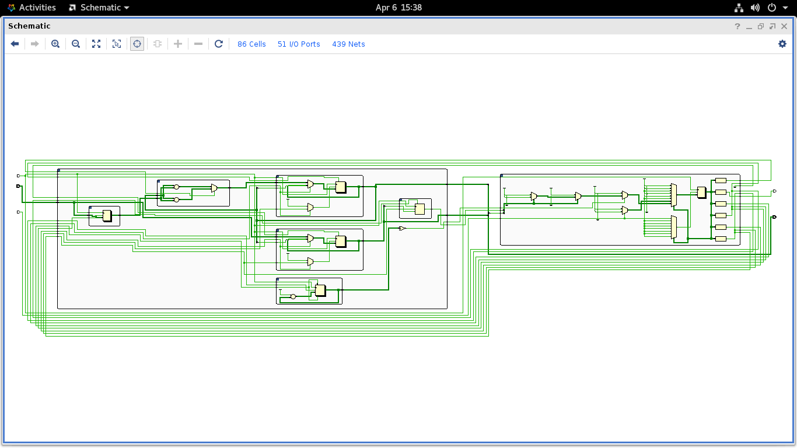
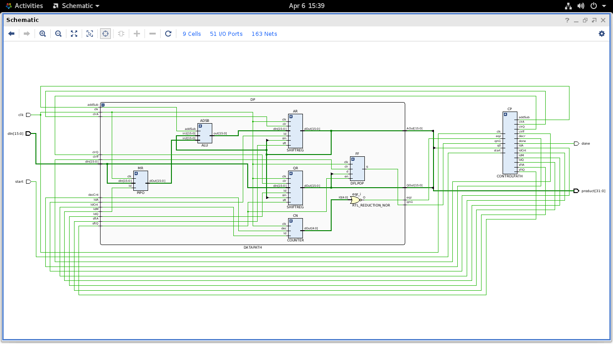
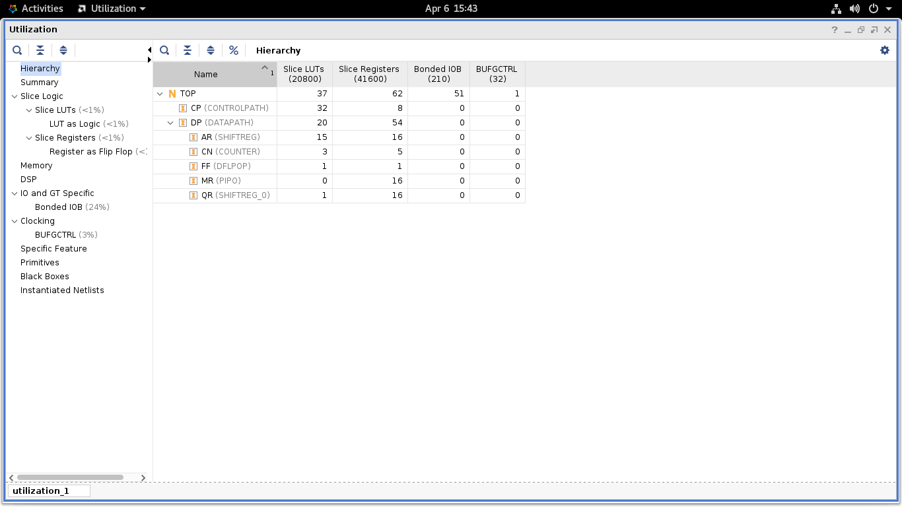

# 16-Bit Booth's Multiplier

A digital multiplier implemented in Verilog, following the Data Path and Control Path architectural partitioning. Developed and verified using Xilinx Vivado on AlmaLinux OS.

## Project Overview

This design uses **Booth's Algorithm** — a signed binary multiplication technique that reduces the number of additions and subtractions by examining pairs of bits in the multiplier. Instead of adding the multiplicand for every `1` bit, Booth's algorithm detects transitions between 0s and 1s, making it efficient for both positive and negative numbers in two's complement representation.

### Key Features

- **Signed Multiplication:** Correctly handles all combinations of positive and negative 16-bit operands using two's complement arithmetic.
- **Modular Design:** Separate modules for shift registers (SHIFTREG), flip-flop (DFLPOP), parallel-in parallel-out register (PIPO), ALU, counter, data path, and control path.
- **FSM Control:** An 8-state controller manages the timing, data flow, and arithmetic decisions.
- **32-bit Output:** The final product is a full-precision 32-bit signed result.

## Architecture

The system is divided into two primary sections:

### 1. Data Path

Contains the functional units where the actual computation happens.

- **Register AR (Accumulator):** A 16-bit shift register that accumulates the partial product. Supports load, clear, and arithmetic right shift.
- **Register QR (Multiplier Register):** A 16-bit shift register holding the multiplier. Its LSB (`q0`) is examined each iteration alongside `qm1`.
- **Register MR (Multiplicand Register):** A PIPO register holding the multiplicand. Its value is added to or subtracted from AR by the ALU.
- **FF (qm1 Flip-Flop):** A D flip-flop with enable that stores the bit shifted out of QR during the previous shift. Together with `q0`, it forms the 2-bit Booth decision pair `{q0, qm1}`.
- **ALU:** Performs either `A + M` (add) or `A - M` (subtract) based on the `addSub` control signal.
- **Counter:** A 5-bit down counter initialised to 16. Drives the `eqz` (equal to zero) signal that tells the FSM when all 16 iterations are complete.

### 2. Control Path

A Finite State Machine that issues control signals based on the current state:

| State | Name | Action |
|-------|------|--------|
| S0 | Idle | Waits for `start` signal |
| S1 | Init | Loads MR (multiplicand), clears AR and qm1 FF, loads counter |
| S2 | Load Q | Loads QR with the multiplier |
| S7 | Evaluate | Reads `{q0, qm1}` and decides next operation — used after both `ldQ` and every shift |
| S3 | Add | AR ← AR + MR |
| S4 | Subtract | AR ← AR − MR |
| S5 | Shift | Arithmetic right shift of `{AR, QR, qm1}`, decrements counter |
| S6 | Done | Asserts `done`, holds final result |

## Theory of Operation

The design implements a synchronous RTL flow. The Controller (FSM) acts as the master, generating enable signals for the registers in the Data Path.

### The Booth Decision

Each iteration, the FSM examines the 2-bit pair `{q0, qm1}` where `q0 = QR[0]` (current LSB of the multiplier) and `qm1` is the bit shifted out in the previous step:

| `{q0, qm1}` | Meaning | Action |
|-------------|---------|--------|
| `00` | Middle of block of 0s | No operation |
| `01` | End of block of 1s | AR ← AR + MR |
| `10` | Start of block of 1s | AR ← AR − MR |
| `11` | Middle of block of 1s | No operation |

### The Loop

After each add or no-op decision, the FSM moves to S5 where `sftA`, `sftQ`, and `decr` are asserted simultaneously — performing an arithmetic right shift of the combined `{AR, QR}` register pair and updating `qm1` with the old `QR[0]`. The FSM then returns to S7 to evaluate the next bit pair. This repeats for 16 iterations until `eqz` goes high.

### Why S7 is Needed

A key design detail: `{q0, qm1}` cannot be evaluated on the same clock edge that QR loads or shifts. Both the shift registers and the qm1 flip-flop update on `posedge clk`, so their outputs are only valid the cycle *after* the clock edge. S7 is a dedicated wait/evaluate state that gives these signals exactly one clock cycle to settle before the FSM makes a branching decision.

### Input Sequence

The two operands are supplied on the shared `dIn` bus in two successive clock cycles:

1. Assert `start` with `dIn = multiplicand` → loaded into MR in S1
2. On the next cycle, present `dIn = multiplier` → loaded into QR in S2

### Final Result

The 32-bit product is formed by concatenating `{AR, QR}` and is held stable in S6 until a new `start` pulse is issued.

## Simulation & Reports

**Simulation Result**

*Shows state transitions, operand loading, iterative add/subtract/shift cycles, and the final 32-bit product.*

**RTL Schematic**

*Internal hardware structure generated by Vivado showing the wiring between the Controller and Datapath.*

**Utilization Report**

*Resource mapping on the FPGA, showing LUT and Flip-Flop count.*

## Related Work

This project is the third in a series of multiplier implementations,
each building on the previous:

1. [**RTL Shift-and-Add Multiplier**](https://github.com/vviszard/verilog_codes_vis/tree/main/shift_add_mul) — Basic unsigned multiplication
   using shift and add at the RTL level, no FSM.

2. [**Repeated Addition Multiplier**](https://github.com/vviszard/repeatedAdditionMultiplier) — Introduced the Control Path &
   Data Path partitioning model with a 5-state FSM. Unsigned only.

3. [**Booth's Multiplier (this project)**](https://github.com/vviszard/boothMultiplicationAlgorithm) — Extends the CP/DP model
   to handle signed multiplication using Booth's algorithm, with
   a more complex FSM and arithmetic right shifting.
